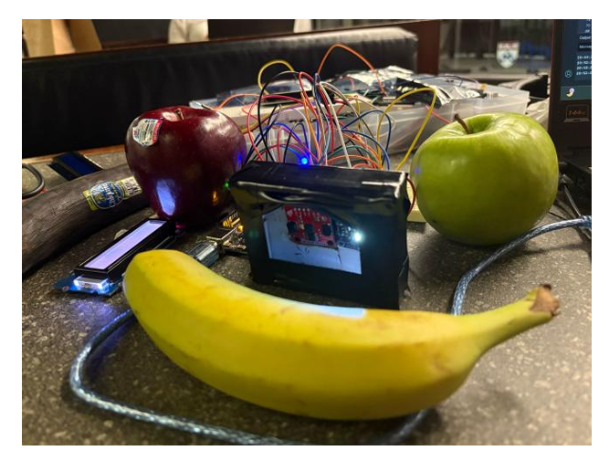
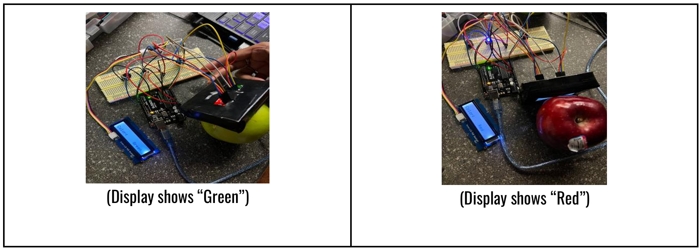
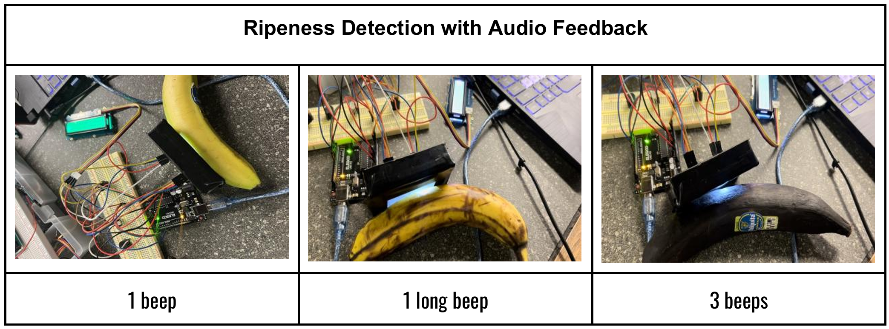
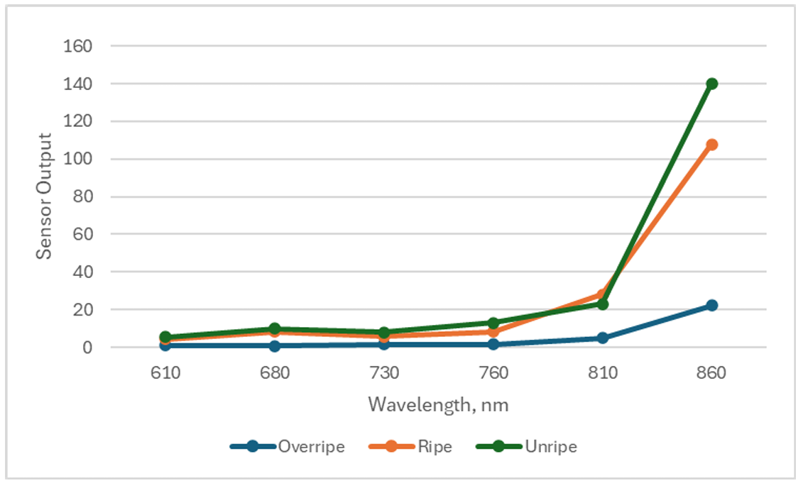

# Fruit Color-and Ripeness Detection System with Audio and Display Feedback

This project presents a smart fruit-sensing system designed to assist color-blind individuals in identifying both the type and ripeness of fruits using color and spectral analysis. The system delivers real-time audio feedback indicating whether a fruit is ripe, unripe, or nearly ripe, while also displaying the fruit’s detected color (e.g., “Red,” “Green,” “Blue,” “Yellow”) on a clear, high-contrast screen. By combining auditory cues with simple visual feedback, the device enables users to independently and confidently assess fruit ripeness—enhancing accessibility and supporting daily tasks such as grocery shopping and meal preparation.

### Novelty of the System

The system integrates two complementary sensing modalities:

* Visible light color sensing using the TCS34725 RGB sensor
* Near-infrared spectral sensing using the AS7263 NIR sensor

This combination enables both fruit color classification and biochemical ripeness analysis, providing a richer and more reliable ripeness assessment than gas-based approaches.

### Working Principle of the TCS34725 RGB Light Color Sensor

The TCS34725 is a light-to-digital color converter that contains an integrated infrared blocking filter and operates in visible light reflectance mode. A white LED illuminates the fruit surface and the sensor measures the reflected light in the red, green, and blue wavelength bands, as well as clear light.

The sensor contains four photodiodes:

* Red: 615–680 nm
* Green: 515–545 nm
* Blue: 465–485 nm
* Clear: broadband intensity

Each channel uses an optical filter and a silicon photodiode to convert photons into electrical current through the photoelectric effect. The signals are amplified, integrated, and digitized using an internal ADC and transmitted via I2C communication.

Banana ripeness is associated with visible color changes:

* Unripe bananas appear more green due to chlorophyll
* Ripe bananas appear yellow
* Overripe bananas show dark brown spots and reduced reflectance

### Working Principle of the AS7263 NIR Spectral Sensor

The AS7263 operates in reflectance mode using near-infrared illumination. Light is reflected from the fruit surface and passes through Fabry–Pérot interference filters, which allow only specific wavelengths to reach each photodiode. The sensor contains six NIR channels, each measuring a fixed spectral band. Each filtered wavelength is detected by a silicon photodiode and converted into an electrical signal. The analog front end amplifies and digitizes the signal before it is processed by embedded logic. Bananas undergo biochemical changes during ripening, including chlorophyll breakdown and sugar accumulation. These changes increase near-infrared reflectance, particularly in the 730–860 nm range, allowing ripeness classification using NIR data.

### Device Implementation

The RGB sensor and NIR spectral sensor are housed inside an enclosure designed to minimize environmental interference. A Grove LCD displays the detected fruit color, and an active piezo buzzer provides audio feedback indicating ripeness.

Color Detection with Display Feedback

The LCD shows the detected fruit color, such as “Green” or “Red,” allowing users to visually confirm the fruit type.

Ripeness Detection with Audio Feedback

Sensor Transfer Function

The change in near-infrared wavelength response varies with fruit ripeness. Measurements show that NIR reflectance increases as the fruit transitions from unripe to ripe due to biochemical changes in the fruit structure.

### Potential Impact

The system is particularly valuable for individuals with color vision deficiencies, especially red-green color blindness, who often struggle to judge fruit ripeness and color. In environments such as grocery stores or kitchens, fast and independent assessment is essential.

This system enables users to independently select ripe fruit, improving nutrition, autonomy, and quality of life. Additional applications include small-scale retail, food services, and home automation.
